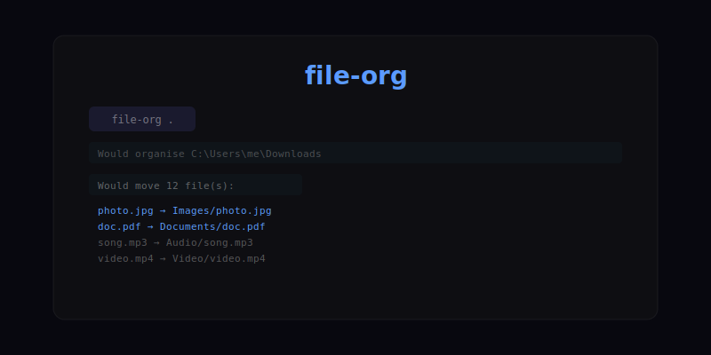

# file-org

A CLI tool that organises files in a directory by category — images, documents, audio, video, archives, code and more.

## Install

`ash
pip install file-org
`

## Usage

`ash
# organise the current directory
file-org

# organise a specific directory
file-org ~/Downloads

# preview without moving anything
file-org --dry-run

# undo last organise
file-org --undo
`

## Categories

| Extension(s) | Folder |
|---|---|
| .jpg .jpeg .png .gif .webp .svg .bmp | Images |
| .mp4 .webm .mov .avi .mkv | Video |
| .mp3 .wav .flac .aac .ogg | Audio |
| .pdf .doc .docx .xls .xlsx .ppt .pptx | Documents |
| .zip .tar .gz .rar .7z | Archives |
| .py .js .ts .jsx .tsx .cpp .h .rs .go | Code |
| .csv .json .xml .yaml .yml .toml | Data |
| .iso .dmg .exe .msi .deb .rpm | Installers |
| everything else | Misc |

## License

MIT © [Alex Black](https://github.com/AlexBlack-Dev)